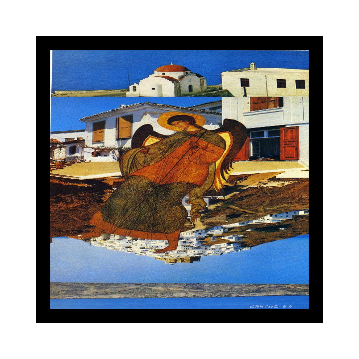

# PoetARy

This project uses MindAR  library  to display a poem when a specific image marker is detected.

## Markers

##Other Demos
- [Demo 1](https://gkalogeitonas.github.io/PoetARy/AR.html)
- [Demo 2](https://gkalogeitonas.github.io/PoetARy/MindAR.html)